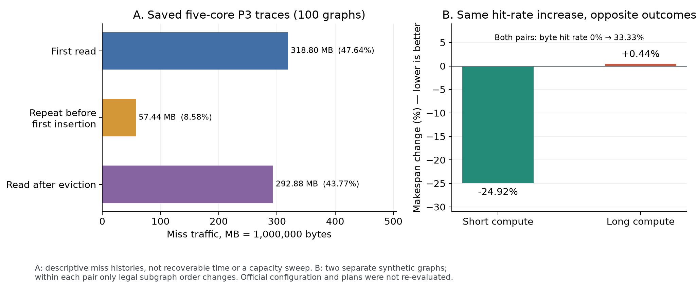

# 共享只读缓存容量与带宽对多核调度的影响

本节在题目固定配置下分析P3的缓存机制：共享只读L2容量为1048576 B，读带宽为250 B/cycle；DDR总带宽为60 B/cycle，两者独立。每核L1、UB仍为私有，容量分别为524288 B、131072 B。分析采用成熟统一算法的既有从头结果、原版评估器和保存的事件轨迹，不改变配置或重新搜索方案。文中的全图池统计属于成熟算法结果，另列的合成实验和探索方案只用于解释机制。

## 1 容量约束作用于驻留集合

P3沿用P2的Task组织、核内编排和跨核同步。L2命中只能改变可查询的COPY_IN所使用的带宽路径，不会取消源核COPY_OUT、500 cycle跨核同步、目标核L1/UB容量约束或搬运流水线约束。评估器按编译后的逻辑张量标识查询缓存，统计对象不应被简单限定为原始图输入。

设缓存容量为\(C\)，张量\(x\)大小为\(s_x\)，发射事件\(e\)发生前的缓存集合为\(K(e^-)\)。正字节COPY_IN的命中条件为

\[
h_x(e)=\mathbf 1\{x\in K(e^-)\}.
\tag{P3-1}
\]

缓存初始为空。未命中读取走DDR，完成后尝试插入缓存；若\(s_x>C\)，该张量不驻留。插入时空间不足，评估器从FIFO队首淘汰旧条目，直至满足容量限制。命中查询不更新FIFO次序，向仍在缓存中的同一张量重复插入也不更新次序，因此该模型不能按LRU描述。

考虑\(x\)某一次实际插入后的驻留阶段。令\(D_x(e)\)为从这次插入之后到事件\(e\)之前，排在\(x\)之后、实际被接纳的其他新插入条目的累计字节数。在没有新的\(x\)重插入改变阶段起点时，\(x\)仍驻留的容量条件为

\[
s_x+D_x(e)\le C.
\tag{P3-2}
\]

该式必须计入目标张量自身大小。例如，\(C=1024\) KiB、\(s_x=600\) KiB，后续成功插入500 KiB时，虽然500 KiB小于容量，\(x\)仍会被淘汰。命中访问、对现存键的重复插入尝试、超容量而拒绝的条目都不计入\(D_x\)。若\(x\)被淘汰后重新插入，应从新插入事件重新计算，不能将整段请求字节直接累加为“复用距离”。

官方实现还在每个COPY_IN完成时调用插入过程：如果一个命中读取尚未完成时其条目被淘汰，完成时可能重新插入；条目仍在时则不刷新FIFO。这个细节进一步说明，分析应以实际插入事件和驻留阶段为准。

对划分和分核而言，容量限制的是一段时间内需要共同驻留的数据，而不是整张图所有输入字节的总和。全图工作集大于1MiB不意味着缓存必然无效；关键是同一张量在两次使用之间是否被足够多的新插入挤出。反过来，容量装得下所有相关数据，也不保证读取命中。

## 2 读取时机决定能否利用已驻留数据

缓存查询发生在COPY_IN发射时，未完成的首次DDR读取不会被其他核心视为已经填充。多个核心在同一时刻冷读相同数据时，可以全部miss，并共同竞争DDR；模型没有将这些在途读取自动合并为一次传输。

设一次插入时刻为\(f_x\)，后继读发射时刻为\(a_x\)。\(a_x\ge f_x\)只是可能命中的时间条件，还要满足事件P3-1中的实际驻留状态。评估器每轮先处理完成及插入，再发射新操作，因此同一cycle允许先完成插入、后发射命中读取；但同cycle其他完成事件也可能插入数据并淘汰\(x\)。有时间戳相等时，必须保留官方事件顺序。

容量与时序可以分别造成失效：

- 后继读发射过早，首次读取还未完成，即使容量充足也miss。
- 后继读发射过晚，目标已被FIFO淘汰，产生再次miss。
- 即使通过合法排序使后继读命中，也可能推迟关键计算；是否值得等待，需要看最终Makespan。

算法只能通过合法的划分、分核和子图顺序影响这些时刻，不能在输出中直接插入等待、预取或虚构操作。可以让独立计算填充首次读取与后继使用之间的间隔，但不能为追求命中率推迟决定完工的计算链。

## 3 独立带宽池如何影响完成时间

命中读取使用共享L2读带宽池，未命中DDR读取以及需要访问DDR的写回使用共享DDR带宽池。两个池可以同时推进，但每个池内部的在途搬运公平共享该池带宽。250 B/cycle是所有命中读取共享的总带宽，不是每核各有250；也不能把60和250相加后分配给一条读取。已有6000 B共享输入微实验中，单次独占DDR的参考耗时为100 cycle，两个核心同时冷读则各需200 cycle才完成；如果后继读取已命中且独占L2，其服务时间为24 cycle。这说明命中除了改变本次读速率，也会改变另一条DDR读取面对的竞争。

对按搬运字节数\(b_i\)计时的COPY，评估器先给出其独占相应带宽池时的参考工作量

\[
w_i^{(r)}=\max\left(1,\left\lceil b_i/B_r\right\rceil\right),
\qquad r\in\{\mathrm{DDR},\mathrm{L2}\}.
\tag{P3-3}
\]

若池\(r\)有\(m_r(t)\)项剩余工作量为正的搬运，每项以\(1/m_r(t)\)的速率消耗其参考工作量。新的搬运加入或已有搬运完成时，官方程序重新分配份额并向上取整预计完成时刻。因此，\(b_i/B_r\)仅是独占带宽近似，不能替代存在并发、依赖和流水线约束时的实际时长。

在一条已确定的执行轨迹中，设两池累计参考工作量为\(W_{\mathrm{DDR}}\)、\(W_{\mathrm{L2}}\)，资源工作量给出必要下界

\[
T\ge\max\left(W_{\mathrm{DDR}},W_{\mathrm{L2}}\right).
\tag{P3-4}
\]

两个池能够重叠，不能将两项相加作为总搬运时间，更不能再与计算时间直接相加作为Makespan。依赖释放、每核单个MTE2槽位、私有缓存空间与计算流水线仍会限制推进。这一下界用于解释资源需求，不等于可达到的总时间，也不是节省周期数的预测。

命中可能产生两种时间收益：本次读取获得更快的服务；同时减少DDR在途竞争，使其他DDR搬运提前完成。两种作用可能重叠，并不等于“命中字节除以60与250的差”。如果被缩短的读取不影响最后完成的路径，或者为了命中推迟了关键消费者，总时间也可能不变或变差。

在给定方案的确定性执行中，还可得到两个有条件的结论：

1. **若全程没有淘汰，也没有超容量拒绝，仅增大L2容量不会改变结果。** 原执行中所有插入均可保留，增大容量不改变查询结果或带宽路径；按事件顺序递推，后续执行保持相同。该结论只比较同一方案和其他参数固定的情况。
2. **若全程没有命中，仅改变L2读带宽不会改变结果。** 没有COPY进入L2读带宽池，该参数没有被用于搬运服务；不能靠提高未被使用的带宽解决读取时机问题。

当存在淘汰或命中时，本节没有给出容量/带宽改变后的定量收益保证。改变服务时间会改变后续发射、插入与淘汰次序，因此不能把原轨迹简单按比例缩放，充当新配置的模拟结果。

## 4 固定配置下的全图池证据

对成熟从头算法的100张五核P3方案，按原顺序重放既有缓存事件，逐项核对查询成员、FIFO淘汰列表、容量占用、最终缓存集合及命中/未命中字节。下面三类miss按其已发生的历史分类，合计669117756 B；它们不是“可消除等待”的分解。

表P3-1　100张五核图的miss字节构成。

|类别|字节数|占全部miss字节|
|---|---:|---:|
|该逻辑张量首次查询，尚无缓存插入|318797114|47.64%|
|曾查询但首次插入仍未完成时的重复miss|57441966|8.58%|
|该张量曾插入、被淘汰后再次miss|292878676|43.77%|
|张量大于1MiB而无法驻留|0|0%|

“淘汰后再次miss”还可能包含淘汰后某次重读尚未完成时的重复读取，不能将其全部认定为增大容量即可消除的流量。表中比例是合并字节占比，受大图影响，不是100张图比例的算术平均。

100张图中，59张发生过淘汰，只有30张出现淘汰后再次miss；83张出现首次插入前重复miss，15张完全无命中。41张图既没有淘汰，也没有超容量拒绝，符合上一节“仅增大容量不改变该固定方案”的条件。83张图的官方时间线存在DDR与L2读取区间重叠，支持将两者作为独立资源分析；重叠时长不等于可节省的关键路径时间。

不同图的主要症状并不相同：

表P3-2　成熟算法五核方案的代表性容量及时序现象。

|图|缓存峰值/B|淘汰条目数|首次插入前重复miss/B|淘汰后再次miss/B|解释|
|---|---:|---:|---:|---:|---|
|046|995936|0|2791200|0|容量未溢出，重复读取过早，命中率为0|
|072|1048576|10994|1003560|82877600|存在大量淘汰后重读，值得检查驻留跨度与消费顺序|
|095|1044610|1626|0|0|存在淘汰，但查询没有后续复用；淘汰次数不能代表有效收益空间|

046的全部可缓存数据可以驻留，却没有产生一次命中，说明增加容量无法修复这份方案的首读重叠问题。095的淘汰条目此后没有被查询，减少这些淘汰本身也不会产生缓存命中。072具备容量/驻留相关问题的直接证据，但82877600 B并不等于任何调整必然节省的流量，更不直接等于可缩短时间。

完整1—5核的既有结果也可用于观察核数变化：

表P3-3　成熟从头结果，每个核数100图。

|核数|逐图字节命中率平均|合并字节命中率|逐图\(T_2/T_3\)平均|P2/P3方案完全相同的图数|
|---|---:|---:|---:|---:|
|1|3.7612%|8.4270%|0.999859|92|
|2|14.5861%|23.8053%|0.998145|67|
|3|18.7598%|26.4988%|1.014170|62|
|4|21.3071%|30.1357%|1.023480|55|
|5|25.2853%|34.0939%|1.051799|43|

每个核数的P2、P3方案分别由算法选优，因此整列\(T_2/T_3\)包含方案差异，不能解释为纯L2硬件加速。命中率随核数增加的总体趋势也不意味着每张图随核数增加都改善。两个命中率汇总分别为\(\frac1{100}\sum_g H_g/(H_g+M_g)\)与\(\sum_g H_g/\sum_g(H_g+M_g)\)，不可混用。

## 5 相同命中收益可以对应相反的完工收益

已保存的官方合成实验使用2核、6000 B共享输入及固定题设参数。在每一组内仅改变合法子图顺序，保持图与分核不变；短计算组与长计算组是不同输入图。

表P3-4　合法错峰读取的正负例。

|组内对照|原时间/cycle|错峰后时间/cycle|字节命中率|miss字节|
|---|---:|---:|---:|---:|
|短计算|313|235|0%→33.33%|18000→12000|
|长计算|3211|3225|0%→33.33%|18000→12000|

错峰方案先执行独立工作，首读在cycle 200完成并填入缓存，后继读在同一cycle命中，独占L2读6000 B需要24 cycle。短计算组减少78 cycle，长计算组反而增加14 cycle。后者的关键计算被推迟，收益不足以补偿顺序变化。两组的官方静态额外COPY均保持6000 B，不能把该字段当作动态DDR miss字节。

另一个正式图的固定方案复评提供了分配与缓存联动的例子：046的成熟方案在P2/P3均为77846 cycle；探索方案在P2为94972、P3为62003 cycle，P3命中率50.9702%。每份方案均在两个场景下独立复评。这表明改变分配/顺序可以改变共享缓存的收益，但该探索方案未晋级成熟默认，其收益也不能归功于本轮没有在该臂实际执行的FIFO联合动作。

图P3-1　左图为成熟五核100图的已发生miss历史分类；右图为两张合成图内合法排序前后的时间变化。两者分别说明miss成因需要区分，以及相同命中率增长不能替代完工时间比较。左图不是容量扫描，右图不是正式图池算法成绩。

## 6 对划分与调度的含义

缓存感知优化应围绕有后续复用的读请求选择候选。首次插入前重复miss突出时，可以在依赖允许下错开首读与消费者，利用独立计算填充间隔；若存在淘汰后重读，应检查是否能缩短生产—消费跨度、聚合同一数据的使用或调整跨核分配。仅有大量淘汰而没有后续重读时，不宜把“减少淘汰次数”当作优先目标。

所有调整都受到并行度、私有缓存压力与DDR搬运的共同约束。合并消费者能够减少重复读取，却可能集中计算；提前消费可以保护FIFO驻留，却可能干扰M/V交织；延迟读取可以增加命中，却可能延长关键链。因此，容量与时序指标适合作为候选生成依据，最终仍按官方Makespan优先、同时间较少额外COPY的规则选优，字节命中率用于解释结果。

本节完成了固定配置下的容量、时序和独立带宽分析，没有新增求解调用，也没有宣称改变容量或带宽后的性能增幅。若后续研究需要此类定量结论，应冻结方案后另做独立配置实验，并与题目固定配置主结果分开报告。
