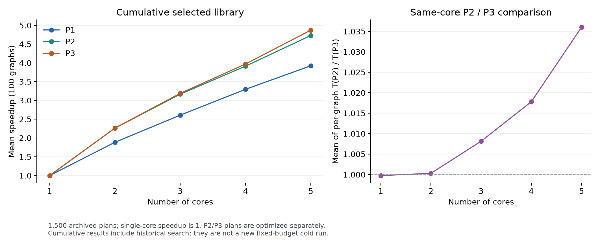

# 累计精选1500配置交付

100张图×P1/P2/P3×1—5核，共1500份方案。五核平均加速比为3.92283844、4.73072391、4.87248217。这是累计多轮精选，不是持续搜索版固定预算从头成绩。

本包基于09f27b0完整库替换37项独立复评通过的方案（36项时间改善、1项同时间COPY改善）。其余1463项保留原验证与来源；全包重新检查1500个计划哈希、合法性、核数、成绩公式和非退步性。

- `selected_plans.tar.gz`：完整1500份官方格式计划，压缩后46358220字节。
- `累计1500配置成绩.csv`：每图/问题/核数的makespan、COPY、原单核分母、加速比和来源；`plan`相对本目录，解包后可直接解析。
- `题目口径核数曲线.csv`：每场景100图平均，单核正式点固定1；另列优化单核对固定原分母的实际比值，不混淆两者。
- `P3同核数汇总.csv`：逐图T(P2)/T(P3)的平均，两场景方案分别优化，包含调度差异，不能当作纯硬件缓存收益。
- `P3五核三指标.csv`：100张图全部时间、COPY、spill、命中/未命中字节和命中率。
- `manifest.json`：包哈希、覆盖、替换数、曲线和来源范围。

SHA256：`225c3e8eead8a97965ecc5c85d1f642442a04a2e959602f4e3347270ab3d4404`。

在仓库根目录先做只读验证（不调用模拟器）：

```bash
python3 A题研究/直接迭代/持续联合冲刺_20260926/analysis/verify_package.py
```

在本目录解包供评测或交付使用：

```bash
tar -xzf selected_plans.tar.gz
```

完整正式实验的全部付费候选位于上一级 `正式v2完整审计`，为避免单文件超过GitHub限制分成三个字节片段。Linux/WSL中进入该目录可恢复：

```bash
cat all_evaluated_plans.tar.gz.part000 all_evaluated_plans.tar.gz.part001 all_evaluated_plans.tar.gz.part002 > all_evaluated_plans.tar.gz
sha256sum all_evaluated_plans.tar.gz
```

整体哈希应为 `d4cef5722c5316b4c01a64451d3c46a00bc970fe72991cbb4f69c41a0682237c`。该包用于复核付费候选与1%/3%搬运折中，不是更高成绩的第二套1500解。



归因和是否晋级的结论见[接手交付报告](../最终结论与接手交付.md)。
