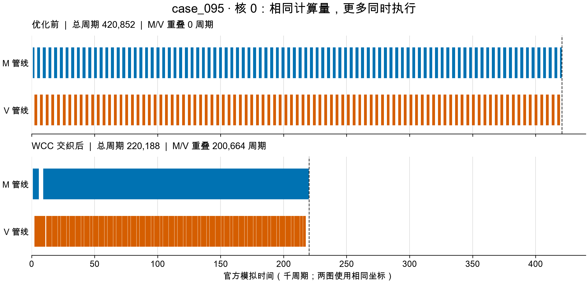

# 第八轮：WCC覆盖扩大，结构选路验证与时间线证据

2026年9月25日。相对第七轮，**39个配置进一步降低官方周期：P2为20个，P3为19个，P1不变；累计方案库零回退，完整导出1500份方案。** 本轮实验已结束，没有遗留的新增长批次。论文继续暂缓，旧长队列保持暂停。本轮代码及成果尚未Git提交。

## 1. 新增收益

这里比较的是两轮累计最好方案，不是两个等预算算法。表中周期均来自原版官方模拟器；官方图、硬件参数和评测逻辑没有更改。

| 图 | 场景 / 核数 | 第七轮周期 | 第八轮周期 | 周期减少 |
|---|---|---:|---:|---:|
| case_095 | P2、P3 / 5核 | 420,852 | 220,188 | 47.68% |
| case_055 | P3 / 5核 | 26,309 | 20,015 | 23.92% |
| case_015 | P3 / 5核 | 42,588 | 33,340 | 21.72% |
| case_070 | P3 / 5核 | 26,655 | 21,056 | 21.01% |
| case_053 | P2、P3 / 3核 | 526,435 | 421,712 | 19.89% |
| case_060 | P3 / 5核 | 180,655 | 160,258 | 11.29% |

39项由五核30项、三核6项、四核3项组成。详见[改善清单](改善清单.csv)与[全部成绩](全部成绩.csv)。每份更优候选必须经过目标场景、目标核数的官方评测，才进入成果库。

| 五核100图指标 | 第七轮 | 第八轮 |
|---|---:|---:|
| P1平均加速比 | 3.576101 | 3.576101 |
| P2平均加速比 | 4.342972 | 4.455132 |
| P3平均加速比 | 4.438815 | 4.562336 |

每图加速比＝原官方单核周期÷本方案周期，再对100图取算术平均。另一指标“逐图配对降时率的均值”为P2 **1.7368%**、P3 **1.8950%**，分母同样包含所有100图和未改善图。两种均值不可互换，均不等同于未经核验的比赛总分。

## 2. 主要突破：相同分核，让M/V计算更多重叠

case_095包含3696个原始计算算子、462个WCC。WCC在这里是可整体保留的弱连通计算分量。原方案虽然分核合理，但同一核上的M/V工作大量交替串行。新候选将不同分量的合法执行顺序交织，使两类管线可以同时忙碌。

P3的精确官方轨迹对比如下；核0在前后均是最晚结束的核心之一：

| 核0指标 | 优化前 | WCC交织后 |
|---|---:|---:|
| M计算忙碌周期 | 215,388 | 215,388 |
| V计算忙碌周期 | 204,228 | 204,228 |
| M/V重叠周期 | 0 | 200,664 |
| 结束周期 | 420,852 | 220,188 |

全部原始计算算子的所属核心完全一致，分区新增搬运和spill新增搬运前后均为0，COPY字节数相同，缓存命中前后均为0。核0的M/V忙碌区间并集缩短200,664周期，与结束周期的缩短量一致；时间轴上M/V并集以外的总时长均为1,236周期。因此，这个实例的证据支持“计算重叠增加”这一解释，不能把收益记成缓存命中改善。

内存并非不变：各核L1峰值从36,864升至49,152字节，UB峰值从37,056升至92,928字节，仍通过官方容量检查。交织扩大了同时存活的数据量；在其他图上，这可能造成spill或抵消收益，所以交织窗口不能盲目加大。

胜出候选是第8次调用的`wcc_protected_interleave_v2_w4_base_earliest_start`。第4次调用的窗口2已得到220,314，第8次的窗口4进一步降至220,188。case_070的有效候选位于第12次调用，也说明过早切走WCC搜索会漏掉收益。



见[机制证据](WCC机制证据.json)、[时间线原始区间表](图表/case095_timeline_data.csv)和[绘图说明](图表/绘图说明.md)。该对照解释这个具体实例，不作为所有图延迟的通用因果分解。

## 3. 新增原图结构选路，但尚不改默认值

新增`routed`模式。将各WCC的M、V及其他计算工作量分别统计，定义：

```
理想每核管线负载 = max(1, max(全图M工作量, 全图V工作量, 全图其他工作量) / 核数)
最大分量管线负载 = max_WCC max(该分量M工作量, V工作量, 其他工作量)
比值 = 最大分量管线负载 / 理想每核管线负载
```

有多个分量且比值≤1.5时，完整搜索`component_wcc`；否则运行`staged`，依次涉及Component/WCC、算子分配、轨迹调整及P3缓存精修。只执行选中路线，不把两法跑满后挑赢家。初始方案、失败和缓存命中都计入总调用额度。规则不读取图号、旧成绩或本轮结果。

该比值忽略依赖、DDR、COPY和缓存，是路线启发式，不是最终周期预测或安全剪枝下界。`routed`为显式可选方法；P2/P3从头默认仍为`staged`，P3已有方案精修默认仍为`legacy`。

开发回归使用009、046、085、094。验证使用004、008、040、053、054、062、063、066、078、079、087、098：在规模≤6000/>6000算子×结构路线的4层中，每层随机选3图，seed=20260930，排除开发4图。选择在新结果产生前完成；验证后未调整规则。这些图历史上可能用过，不能称完全未见测试集。见[选择记录](结构路线选择.json)。

两组均比较3种方法，每图每场景五核、seed17、最多12逻辑调用、120秒软总预算、单次60秒。共享成功缓存以减少重复评测，但命中仍占逻辑额度。所有96个配置均返回成功，全部32个routed配置与被选中分支的成绩一致。

| 组别 | 场景 | routed对照 | 胜 / 平 / 负 | 平均配对降时 |
|---|---|---|---|---:|
| 开发4图 | P2 | staged | 2 / 2 / 0 | 8.6760% |
| 开发4图 | P3 | staged | 2 / 2 / 0 | 8.6080% |
| 验证12图 | P2 | component_wcc | 6 / 6 / 0 | 22.5762% |
| 验证12图 | P3 | component_wcc | 6 / 6 / 0 | 20.7632% |
| 验证12图 | P2 | staged | 4 / 7 / 1 | 0.4762% |
| 验证12图 | P3 | staged | 3 / 6 / 3 | -0.0985% |

配对降时＝100×(1−routed周期/对照周期)。对staged的验证中位降时均为0，样本仅12图，不作统计显著性或总体优势声明。**原图工作量能排除一部分明显不适合整分量分配的图，但不足以判断何时值得放弃后续精修。**

负例全部保留：

| 图 / 场景 | routed周期 | staged周期 | routed慢 |
|---|---:|---:|---:|
| 004 / P3 | 83,319 | 82,161 | 1.41% |
| 078 / P2 | 511,983 | 491,076 | 4.26% |
| 078 / P3 | 511,983 | 468,009 | 9.40% |
| 079 / P3 | 6,024,541 | 6,023,112 | 0.024% |

详见[逐图比较](结构路线逐图比较.csv)和[比较汇总](结构路线比较汇总.csv)。累计方案库可以保留过去更好的方案，因此库中零回退，不代表routed本身零负例。

## 4. 定向扩展与不同核数

定向WCC首批选择065、095、015、023、012、055、017、070：排除开发和验证图，在剩余中小图中按全图M/V工作量均衡程度排序，选前8张。16个P2/P3配置相对第七轮均改善。5次代表方案独立复评一致后，沿用原排序继续检查052、061、060、077、032、057、034、007，第二批16项中11项改善。

第二批失败机会也保留：032的P2/P3、061的P2/P3以及052的P2未超过旧库，因而继续保留旧方案。两批是有目的地寻找WCC机会，**27/32的改善比例不是随机验证成功率**。没有把它们追加进12图验证均值。见[定向扩展选择](定向扩展选择.json)、[首批结果](定向WCC首批结果.csv)、[扩展结果](定向WCC扩展结果.csv)。

043、053、094的三核routed各跑P2/P3，6项均改善；这验证了三核入口，不构成完整三核方法对照。随后将更优低核计划补空核，在目标四核场景重新官方评测，另获得043/P2、043/P3、053/P2三项改善。10次P2/P3互用检查没有新增收益，均为已有成功评测缓存命中。

## 5. 实际耗时与复现

本轮各批次合计161条搜索、迁移或复评记录，1,624次逻辑调用，其中692次新官方评测。不同批次有并行重叠，不能把批次墙钟相加当本轮总耗时；共享缓存批次也不能冒充冷启动提速。[主要批次成本](主要批次成本.csv)保留完整口径。

另做4个原图开始、全新缓存的冷启动，全部实际用满12次新评测，2个worker的批次墙钟53.55秒：

| 图 / 场景 | 路线 | 周期 | 完整求解秒数 |
|---|---|---:|---:|
| 095 / P2 | component_wcc | 220,188 | 5.49 |
| 095 / P3 | component_wcc | 220,188 | 6.40 |
| 054 / P2 | staged | 318,908 | 45.31 |
| 054 / P3 | staged | 356,338 | 47.97 |

这是本机观测，包含候选生成与评测；不同机器、图规模和运行负载会改变秒数，不能推广为全部图的上限。总秒数是软上限，候选生成和IO可能有少量超出。评测周期和程序运行秒数是两回事。

以下命令另外实际执行过：不读取旧方案、12次全部新评测，5.58秒得到220,188周期。在“中文题目”目录运行，输出应使用未存在的新目录：

```sh
python3 -B A题研究/直接迭代/solve.py --case 95 --problem 3 --cores 5 \
  --from-scratch --p23-method routed --fresh-evaluations \
  --budget 12 --seconds 120 --evaluation-timeout 60 \
  --out my_runs/p3_case95_routed
```

求解器使用Python 3.12标准库；Matplotlib仅为可选绘图依赖，不影响求解。CLI记录见[命令行冷启动](命令行冷启动记录.json)。

## 6. 检查与下一步

29项单元测试通过。1500份导出方案逐项对应成功官方记录，精确保留方案内顺序，全部目标不回退；39份变化方案重新验证DAG及核数。两批共9个代表方案在新目录独立官方复评，周期及附加搬运目标均与保存值一致。其余1461份未改变的方案沿用已有成功记录，未声称本轮重新评测全部1500份。见[检查结果](检查结果.json)和[独立复评](独立复评汇总.json)。

下一步优先解决以下问题：

1. **从“总工作量”推进到“实际可重叠空间”。** 用初始官方轨迹识别关键核M/V重叠、管线空闲及同时存活内存，解释078等误判；先形成机制指标，再决定是否进入规则。初始评测仍占总预算。
2. **保护晚期有效候选。** 070第12次、095第8次才出现更优结果，简单早切换会损失机会；在预算内设计少量代表性交织窗口，并为确有读/搬运瓶颈的图保留后续精修额度。不得同时给每个分支完整预算后再称“同预算”。
3. **P2与P3分别判断后续价值。** 当前相同路由忽略缓存读瓶颈；P3验证负例更多。需在开发组分析具体时间线，再预先选新的验证组，保留本轮负例，不用验证成绩反复调1.5阈值。

本轮最可靠的进展是WCC搜索带来的实际方案改善及可解释的时间线证据；自动路线选择仍需改进。完整方案见[方案目录](方案)，运行入口见[README](../README.md)。
