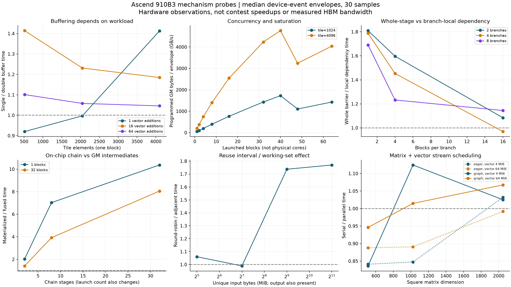
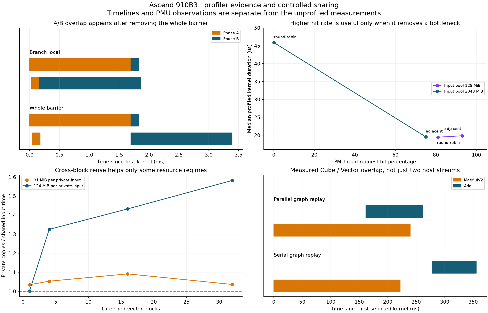

# 910B3真机实验：结果、机制与赛题映射

日期：2026-09-26。分支：`codex/ascend910b-mechanism-study`。

**已经在真实Ascend910B3上完成7类机制实验、488个配置批次、14,640次正式计时序列，全部通过输出正确性检查。** 另有36次冒烟计时、28次正式应用级profiling和1次profiling通路检查。488包含复测批次，不是488种互不重复的问题；每条计时序列可包含多个kernel。

最有价值的结论是：**减少不必要的整体屏障、缩短中间量的生产消费距离、让关键读取落在有效复用窗口内，确实可能大幅降低时间；更多并发、更高命中率、更多buffer都不能单独保证收益。** 下文的倍数属于相应硬件微实验，不能当作P1/P2/P3的加速比或得分。本轮没有重跑赛题1500组合，也没有产生新的赛题成绩。

算法实现入口见[统一算法攻坚交接](统一算法攻坚交接.md)。原先的[可行性与实验路线](可行性与实验路线.md)保留立项时的判断，本报告更新实际完成情况。

## 1. 实际设备与题目模型

|项目|本次设备证据|赛题中必须遵守的定义|
|---|---|---|
|设备|Ascend910B3；管理编号3、逻辑编号0；运行时仅见1张设备|配置中的1—5个逻辑核|
|计算资源|ACL返回20 Cube、40 Vector；SDK配置为分离式架构|每个逻辑核的M、V及搬运管线，不能直接按40个物理Vector核调参|
|L2|ACL返回192MiB|P3固定1MiB、250B/cycle、只读FIFO；命中不刷新FIFO顺序|
|核内空间|SDK配置L1 512KiB、UB 192KiB；属于配置查询，未逐字节测容量|L1 512KiB、UB 128KiB；按官方编译器的分配与spill规则执行|
|主存|板卡显示64GB HBM；实际访问可由L2服务|DDR总带宽固定60B/cycle|
|P1|用真实独立分支实验研究整体等待的代价|每个子图形成Task；前驱Task全部完成才释放；跨Task搬运及固定同步代价|
|P2|用核内保留、局部消费实验研究复用|同核子图合为Task，L1/UB仍然私有；跨核依赖经DDR/COPY，**不是共享L1**|
|P3|真实共享地址、访问顺序与PMU计数实验|在P2上增加共享FIFO；只对符合规则的COPY_IN查缓存，miss在读取完成时插入|
|可提交方案|真机实验可改kernel、buffer、stream|赛题只接收`node_to_subgraph`与`core_schedules`；不能提交自定义kernel或改config|

依据：[设备查询](机制实验/device_attributes.json)、[原题配置](../../选题分析/A题附件/data/config.txt)及官方三个评测器。ACL的UBUF属性虽然返回成功，但数值为0，不能解读为物理UB容量为零；上表UB来自已安装SDK的Ascend910B3配置。

软件为平台已安装的CANN 9.0.0目录、Python 3.11.4、torch 2.7.1+cpu与torch_npu 2.7.1.post4。实际MatMul和Add均已上板，`+cpu`字样不代表扩展不能使用NPU。实验末尾设备Health OK、没有列出运行中的NPU进程，见[结束状态](机制实验/device_end.txt)。

## 2. 测量方式与可靠性

|正式批次|配置批次|计时序列|内容|
|---|---:|---:|---|
|full_01|336|10080|buffer/粒度、并发、屏障、核内保留、读取顺序|
|confirm_01|32|960|4类最佳/最差配对，新进程、原规模与双倍规模复测|
|sharing_01|64|1920|跨block真正共享输入地址，对照独立副本|
|sharing_confirm|8|240|共享输入最佳/最差配对复测|
|mixed_01|24|720|框架即时提交的矩阵/向量串行与并发|
|mixed_graph_01|24|720|同类工作捕获为NPUGraph后重放|
|合计|488|14640|每配置10次预热、30次正式样本|

自定义Ascend C内核计算可精确验证的`x + rounds*y`；首版逐元素比较CPU参考，扩展版使用同一数学参考的周期填充与完整字节比较，出现差异才逐元素诊断。矩阵/向量组检查全部输出是否等于解析参考。所有验证均在计时之外；没有只抽几个输出元素。

每轮随机排列对照，记录种子与样本编号。时间列`device_envelope_us`是ACL/NPU事件包围的设备时间，**包含设备等待和可能的host提交空隙，不等于纯kernel时间**；另记`host_us`。profiling单独执行，不把带profiling的耗时混入30次正常计时。常规整应用msprof保留实际kernel顺序，没有采用逐kernel反复回放来构造缓存命中。

配对比值定义为`基线中位时间/候选中位时间`；大于1表示候选较快。另对每轮配对比值做1000次bootstrap，报告中位比值的95%区间。表中区间对应配对比值统计，并不严格以“两个中位数之比”为中心。探索阶段没有做多重比较校正，不能把挑出的最大值当作期望平均收益；新进程及双倍规模复测用于检查重复性，也不等于未见赛题图的泛化验证。

本地独立审计核对了123个导出文件的SHA256与大小、每配置30个不重复样本、全部正确性标记、正且有限的计时、从原始数据重算的中位数，以及实际运行源码快照。结果：[本地复核](机制实验/本地复核.json)。

## 3. 核心结果

以下均为对应配置的正常计时中位数，单位µs；示例经过挑选，不能理解成全部配置都达到该收益。

|控制变量|基线 → 候选|时间比|独立原规模 / 双倍规模复测|对赛题的启发|
|---|---:|---:|---:|---|
|整体A屏障 → 分支局部A→B|3432.52 → 1896.78|1.810|1.808 / 1.830|P1先改人为等待结构，再分核|
|32阶段GM落地 → UB内完成|16130.07 → 1555.40|10.370|10.314 / 10.434|P2缩短生产消费距离；此组launch数也变了|
|大输入池轮转 → 相邻复用|11622.34 → 6565.45|1.770|1.766 / 1.833|P3按有效复用窗口组织关键读取|
|各块私有副本 → 共享同一输入|1304.94 → 824.76|1.582|1.494 / 1.528|考虑fanout与共享读取足迹|
|适合的单buffer → 双buffer|17361.43 → 12274.23|1.414|1.404 / 1.404|只有存在可重叠工作时才值得增加流水资源|
|不适合的单buffer → 双buffer|1881.24 → 2048.79|0.918|0.921 / 0.921|额外管理与粒度代价可抵消流水收益|
|1024矩阵＋4MiB向量，图重放串行 → 并发|400.96 → 356.63|1.124|另有实际重叠时间线；未做双规模确认|M/V互补需要工作量、释放时机与资源同时匹配|

主表原始依据：[首轮配对](机制实验/full_01/pairs.csv)、[确认配对](机制实验/confirm_01/pairs.csv)、[共享配对](机制实验/sharing_01/pairs.csv)、[共享确认](机制实验/sharing_confirm/pairs.csv)、[图重放对照](机制实验/mixed_graph_01/summary.csv)。



### 3.1 P1：改变整体等待，比搬动非关键工作更有用

`barrier_038/039`保持4个kernel、算术工作与程序显式GM流量不变，只将“所有A结束后才允许B”改成“每个独立分支的A结束即可推进自己的B”。两个分支的A/B计算轻重相反，局部推进可以填补原来的空隙。

时间比为1.810，配对95%区间约1.800—1.813。profiler中各kernel耗时总和几乎相同：3651.474与3651.492µs；整体kernel跨度却从3394.248降至1860.957µs。原方式第一个B在最后一个A结束之后启动；改进后第一个B提前到165.223µs，最后一个A仍要到1695.594µs才结束，出现约1530.371µs的A/B重叠窗口。这支持收益来自依赖释放，而非少计算或少启动。

36个屏障配对中26个的配对区间下界超过1.05，但也有初测略差、复测波动较大的高并发例。**有可独立推进的分支且资源仍可承接，才有稳定机会。** 如果原图本身就是强串行链，移除合法依赖既不可行也不正确。

赛题落点是跨旧Task边界的依赖分支重划：改变聚合引入的整体等待，同时联合分核与排序；不能只将旧Task按算子数量切碎。

### 3.2 P2：局部保留的收益很大，但不能把10倍直接搬进论文成绩

`reuse_033/032`的32阶段数学工作相同；分阶段方案每次从GM读入并写回，融合方案在UB中完成多轮计算。程序显式GM流量从384MiB降至12MiB，kernel启动从32次降至1次。原规模与双倍规模均复现约10.3—10.4倍时间比。

这同时改变了GM访问、kernel数、循环和标量控制成本，**不能把全部收益归因于主存搬运减少，也不能声称题目任意融合都能提高10倍。** 36个配对中34个区间下界超过1.05；小规模组对host及固定开销更敏感，复测收益幅度也不同。

对P2真正可实现的是：同核安排可复用的生产者和消费者，减少中间量外溢、重复COPY及过长存活区间。题目核内只有有限L1/UB，合并扩大存活集合时可能反而引入spill。本轮没有直接测定题目编译器的spill阈值，必须用官方编译轨迹决定是否接收候选。

### 3.3 P3：复用窗口可以改变性能，单独提高命中率可能无效

`cache_047/046`访问相同地址多重集，执行相同256个kernel；只将跨大池轮转改为同一区域的多次访问相邻。正常计时从11622.34降到6565.45µs，时间比1.770；配对区间约1.760—1.779。独立L2计数中，读请求加权命中率从0.0362%升到75.0088%，kernel中位时间从45.901降至19.540µs。时间、计数器和复测共同支持此处存在可利用的缓存复用。

但是128MiB输入池的`cache_043/042`，命中率从81.0375%提高到92.9450%，正常时间却为423.87→428.54µs；配对区间跨过1，不能认定改善。24组读序配对中仅6组区间下界超过1.05，全部配对的时间比中位数约1.005。**“命中更多”只有在它减少关键等待或拥塞时才值得追求。**

PMU口径为相关读端口的`hit/(hit+miss_allocate)`请求计数汇总，不是P3的可缓存COPY_IN字节命中率。实际芯片替换策略没有在本轮被识别为FIFO；算法必须严格使用题目规定的插入、淘汰和完成时刻。

### 3.4 真正跨块共享输入：收益取决于足迹，而非“共享”这个名字

新增实验让多个block读取同一GM输入地址，对照各block读数值完全相同的独立副本。输出、算术工作和程序访问字节数相同，唯一读取地址集合缩小。`sharing_060/061`每个私有输入124MiB、32个block；两个读输入的唯一足迹从248MiB降至127.875MiB，但还存在124MiB输出及其他缓存活动，不能只用读输入和L2容量比较就断言机制。

正常时间比1.582，独立复测1.494，双倍规模1.528；PMU读命中率从0.00425%升至48.4394%。单block对照中两种布局实际访问同样的地址，时间约6720.92与6718.75µs，命中率都接近100%，符合不应产生明显收益的预期。

32个配对仅5个区间下界超过1.05，全部时间比中位数约1.006。需要把共享输入的fanout、到达间隔、唯一足迹和关键消费者结合起来，不能把所有共享输入消费者盲目挤在一起。

### 3.5 双buffer与粒度：有正例，也有稳定的反例

`pipe_055/058`的时间比约1.414，复测约1.404；profiler的Vector活动比例中位值从0.6595升至0.9035，支持适合的粒度和计算强度下流水利用率提高。

`pipe_000/003`则稳定变慢约8.9%，复测仍变慢约8.6%。该组标量管线活动比例接近99.8%，增加buffer管理未换来足够的并行收益。54个单双buffer配对，32个区间下界超过1.05，5个区间上界低于1/1.05，其余不足以支持超过5%的稳定差异。

这里的标量控制不是题目显式建模的独立资源，不能直接给赛题增加“scalar惩罚常数”。可迁移的是选择粒度时同时检查计算、搬运、同步、存活空间，而不是只按操作数量切分。

### 3.6 并发不是越多越好

固定单输入60MiB、tile4096、每元素一次Add、4次launch时，block数1/2/4/8/16/32/40的中位时间依次为3808.36/1988.54/1012.05/538.34/296.61/178.35/158.52µs。增加到48却变成232.99µs，比40多约47%；64时回落至186.92µs，仍慢于40。

40与设备Vector核数一致是线索，但不是已隔离的唯一原因：block粒度、调度波次和访存行为一起变化。不能把“40最佳”写成题目1—5核的策略参数。`logical_GBps`按程序读写字节计算，最高约4.76TB/s，**这不是实测HBM带宽**，因为L2会服务一部分GM访问。

赛题适合生成限制同时争用DDR的合法顺序、让M/V或搬运需求互补的分配候选，而非为了使用更多核而强行拆分。

### 3.7 M/V互补：解决host提交混杂后，才看见真实条件

初始即时提交实验中，1024矩阵＋4MiB向量串行699.82µs、并发825.77µs，表面上并发更差。捕获16次MatMul与16次Add为图后重放，同组变成400.96→356.63µs，时间比1.124，配对区间约1.114—1.133。减少逐个Python提交空隙后，观察才更接近设备调度问题。

独立profiler确认MatMulV2运行于AI_CORE、Add运行于AI_VECTOR_CORE；最后一组kernel的串行时间线没有交叠，并发时间线有77.721µs的Cube/Vector重叠。这是“设备上实际重叠”的证据，不只是创建了两个host stream。

但512矩阵＋4MiB向量图重放由277.93变成332.37µs，反而慢约19.6%，profiling也没有观察到两类kernel重叠。局部kernel跨度可因间隙减少而缩短，仍不代表事件包围的整体时间改善。六种尺寸配对中有正有负，不能将“矩阵和向量放两个流”当作普适规则。



## 4. 带回统一算法的决定

**优先研发“关键等待链驱动的局部联合改编排”，共用预算控制器，但按P1/P2/P3语义生成不同候选。**

1. **P1：屏障消除候选。** 从关键Task等待回到操作依赖，跨旧Task重划独立分支，将重划、迁移、交换和可选合并组成完整方案；检查是否真正让关键后继提前执行。
2. **P2：存活空间约束下的复用候选。** 将生产者、关键消费者、共享输入放入同一局部优化区域，比较靠近消费、改分核和保留分离的版本；用官方COPY与spill轨迹核验，保护原有并行。
3. **P3：关键读取与FIFO窗口联合候选。** 优先处理造成完工拖延的miss、重复读取与到达间隔；只在合法依赖与已有松弛内调整顺序，按官方缓存插入完成时刻计算收益。
4. **三场景共用：资源互补与分波候选。** 用题目M/V周期、DDR需求与核内存活量分类；读密集区域避免同时挤占DDR，计算互补区域尝试交织；最终都以官方完整方案时间选优。

所有规则必须依赖图结构与轨迹，不能用case编号选择答案。硬件收益只提高候选的研究优先级，不构成官方评分中的奖励项，不作为未经证明的硬剪枝阈值。可执行的候选定义、共享B16预算和淘汰条件详见[交接文件](统一算法攻坚交接.md)。

这轮已经解决“有哪些机制值得研究”的主要不确定性。此时继续扩大同类微实验参数网格，价值低于将上述四类候选放回官方评测。后续上板应由一个明确争议触发，例如共享读收益是否被写流污染，或更深保留是否因实际存储压力反转；本轮没有把这些未测问题写成结论。

## 5. 复现与归档

源码入口：[实验README](../../tools/ascend910b/mechanisms/README.md)。首版Ascend C测量器对应提交`c5abcba`；扩展实验代码对应`7917ce9`，后续提交主要补审计、图表与报告。实际运行的核心源码以[初版快照](机制实验/source_snapshots/initial.tar.gz)、[扩展快照](机制实验/source_snapshots/expanded.tar.gz)及各批次manifest的SHA256为准；源码快照核对通过，不以最终脚本名称替代历史版本。

完整正式原始CSV、30次样本、配置、源码/二进制哈希、汇总、代表性profiler原始CSV和时间区间JSON均入Git。所有逐kernel数据库与时间线另存本地`机制实验/runs/profiler_raw_all.tar.gz`，不将大型生成物加入Git。

|归档|SHA256|
|---|---|
|最终远端导出`export_final_02.tar.gz`|`a6a3cc9765a1550115105c92f8c50050c5424f2ae4e66f3b92910697d1a407c9`|
|完整profiling归档`profiler_raw_all.tar.gz`|`a9960077e1caa07835f4c099d239894de6aa85cd0a2e0c766e21ee04cb9f48b3`|

两份归档下载后均校验SHA256。最终导出清单含123个文件；`本地复核.json`是导出后生成的审计结果，因此不包含在原导出清单内。构建产物、SSH配置、身份文件和平台凭据不入库。

离线验证，不需要NPU：

```bash
python3 tools/ascend910b/audit_evidence.py A题研究/真机机制研究_20260926/机制实验
```

上板复现须先加载本实例的`/home/developer/Ascend/cann-9.0.0/set_env.sh`，按README构建，在新的输出目录运行；不要覆盖冻结结果。远端实验目录为`/home/developer/ascend-lab-codex-1z1yBI`。没有改动cannbot工程、驱动、工具链或全局shell配置。另一对话的算法工作树保持独立。

工具接口和解释参考[官方Ascend C调用接口](https://www.hiascend.com/doc_center/source/en/CANNCommunityEdition/900/programug/Ascendcopdevg/atlas_ascendc_10_0056.html)、[官方profiling指标说明](https://github.com/Ascend/msopprof/blob/master/docs/en/user_guide/msopprof_performance_data.md)、[官方NPUGraph说明](https://github.com/Ascend/pytorch/blob/master/docs/zh/developer_notes/npugraph.md)。实际执行以本实例安装的头文件、API与采集结果为准；报告中的测量数字均来自本项目真机证据。
